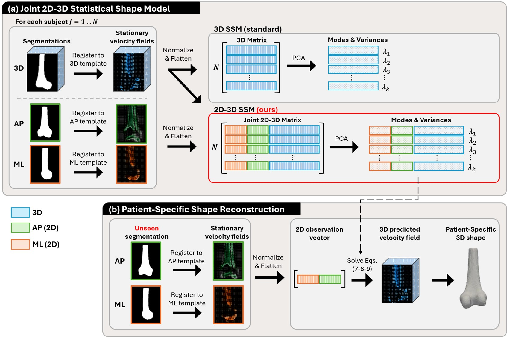

# A Joint 2D–3D Statistical Shape Model for Orthopedic Reconstruction

This repository contains the official code associated with the paper **"A Joint 2D–3D Statistical Shape Model for Orthopedic Reconstruction"**.

## Overview
This work proposes a **joint 2D-3D statistical shape model** that captures the co-variation between 2D and 3D images in a shared latent space. By learning the 2D-to-3D mapping during training, our approach enables fast and accurate 3D reconstruction from 2D images alone at inference.

## Framework

<p>
  <center></center>
</p>


## Installation

To use our code, clone the repository and install the required dependencies:

```bash
git clone https://github.com/florence-dellaniello-picard/joint2d3d-ssm
cd joint2d3d-ssm
pip install -r requirements.txt
```

We recommend using a virtual environment to avoid dependency conflicts:

```bash
python -m venv venv
source venv/bin/activate
pip install -r requirements.txt
```

## Usage

### 1) Prepare data

The data is provided by [NMDID](https://nmdid.unm.edu/), and organized under a single `input_root` directory as follows:

```
{input_root}/
├── {report_path}
├── images/
│   ├── {patient_id}_L.nii.gz
│   └── {patient_id}_R.nii.gz
├── templates/
│   ├── template_3d.nii.gz
│   ├── template_ap.nii.gz
│   └── template_ml.nii.gz
└── checkpoints/
    ├── vxm_3d.pth
    ├── vxm_ap.pth
    └── vxm_ml.pth
```

The patient report (`report_path`) is its own CSV, with at least the following columns:

| column                   | description                                                                                       |
  |--------------------------|-----------------------------------------------------------------------------------------------------|
  | `patient_id`             | unique patient identifier, matching the `deidentified_record_number` provided by [NMDID](https://nmdid.unm.edu/) |
  | `split`                  | one of `registration`, `shape_model`, `val`, `test`                                                |
  | `excluded_L`              | `Yes`/`No` — whether the left side is excluded                                                     |
  | `excluded_R`              | `Yes`/`No` — whether the right side is excluded                                                    |                                    |

- **images** — a `.nii.gz` segmentation volume per patient/side. Only sides marked `No` (not excluded) in the report are used.
- **templates** — a fixed reference for each view, that every subject is registered to during training and inference.
- **checkpoints** — pre-trained VoxelMorph registration weights, one per view. Copy the ones provided under [`src/vxm_checkpoints/`](src/vxm_checkpoints/) into `{input_root}/checkpoints/`.

For reference only, our images were preprocessed as follows (the resulting images are not released):

- A random split into `registration` (65%), `shape_model` (15%), `val` (10%) and `test` (10%) sets, keeping both femurs of the same individual in the same subset.
- 3D femoral segmentations obtained automatically with [TotalSegmentator](https://github.com/wasserth/totalsegmentator).
- Right femurs mirrored to the left side, and all segmentations rigidly aligned to a reference femur using ANTs, then cropped to 180 mm and padded to a fixed volume size of 128 × 256 × 256 vx.

### 2) Configure paths

Edit [src/configs/joint2d3d-ssm.yaml](src/configs/joint2d3d-ssm.yaml) and set:

- `input_root` — path to the data directory described above
- `output_root` — where registrations, the fitted SSM and results are written
- `report_path` — path to the patient report CSV
- `images_dir` / `templates_dir` / `checkpoints_dir` — default to `{input_root}/images`, `{input_root}/templates` and `{input_root}/checkpoints`, and can be overridden independently if needed

### 3) Running code
The code is located in the `src` folder.

#### 3.1) Joint 2D-3D Statistical Shape Model (Training)
To train the model, use

```bash
python main.py --run train
```

#### 3.2) Patient-Specific Shape Reconstruction (Inference)
To run inference, use

```bash
python main.py --run inference
```

Use `--run both` (the default) to run training followed by inference in one call.

#### Other useful flags

| flag                 | description                                                        |
|----------------------|---------------------------------------------------------------------|
| `--config`            | path to the YAML config (default: `configs/joint2d3d-ssm.yaml`)    |
| `--root_input`        | override `input_root` from the config                               |
| `--root_output`       | override `output_root` from the config                              |
| `--reg-strength`      | override the inference-time regularization strength for 2D→3D encoding |
| `--variance-target`   | override the PCA variance target used to pick the number of modes    |
| `--id`                | slurm array id, used to process a single patient/chunk               |
| `--incremental`       | number of patients per Slurm chunk                                  |

